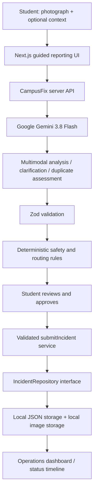

# CampusFix AI

**See it. Report it. Fix it.**

A working multimodal campus operations prototype for **NC State MLH Hack Day — Best Use of Google Gemini API**. Photograph a campus problem, answer only the missing questions, review the generated service request, and approve it. The report immediately appears in the CampusFix Command Center.

> Hackathon Prototype — Not an official NC State service. CampusFix AI is not affiliated with or operated by NC State University. Reports stay in this application's local demonstration system; no university portal or emergency service is contacted.

## Problem

Students notice broken infrastructure but often do not know how to describe it, assess urgency, find the correct campus service, or check whether someone already reported it. Campus reporting is fragmented across departments and forms.

## Solution

CampusFix turns a photo and optional natural-language context into a validated incident. Gemini identifies observable evidence, describes the possible issue, flags hazards, asks targeted questions, and prepares a professional report. Deterministic safety and routing rules apply before persistence. A student must explicitly approve submission.

## Setup

Requires Node.js **22 or later** and npm. No external database, Docker, or university credentials are required.

```bash
npm install
cp .env.example .env.local
```

Edit `.env.local`:

```dotenv
GEMINI_API_KEY=your_actual_key
GEMINI_MODEL=gemini-3.5-flash-lite
DATA_BACKEND=json
```

Then:

```bash
npm run dev
```

Open [CampusFix](http://localhost:3000) and the [operations dashboard](http://localhost:3000/admin).

The homepage loads without a key. **Try Demo** explicitly uses fictional fixtures and no Gemini request; live mode never falls back to simulated analysis. With no key, a live analysis attempt displays a useful setup message without crashing.

The dev/build scripts use Next.js's supported Webpack option for reliability in local environments that restrict Turbopack subprocess port binding. There are no remote font or image dependencies.

Production preview:

```bash
npm run build
npm start
```

## Architecture



- `app/`: homepage, `/report`, `/admin`, `/incidents/[id]`, API routes, error states.
- `components/campusfix/`: guided capture, staged progress, report workflow, shared report cards, dashboard and detail interface.
- `lib/gemini/`: lazy server-only SDK client, prompts, image analysis, clarification, duplicate detection.
- `lib/incidents/`: canonical Zod schemas, repository interface, serialized JSON implementation, explicit-approval submission service.
- `lib/safety/` and `lib/routing/`: deterministic application guardrails and sourced service registry.
- `lib/demo/`: four explicit demonstration scenarios and five fictional seed reports.
- `lib/server/`: bounded request validation, clean errors, upload signature checks and storage.
- `tests/`: business logic, mocked Gemini integration, and Playwright end-to-end checks.

## Gemini usage

The official **`@google/genai`** SDK runs only on the server, defaulting to **`gemini-3.5-flash-lite`**. The implementation follows the installed SDK's `models.generateContent`, `responseJsonSchema`, `responseMimeType`, `ThinkingLevel.LOW`, and abort-signal types.

1. **Multimodal perception:** `analyzeIncident.ts` sends inline image bytes and the user's description/location in the same request. Text-only reporting is also supported for issues such as Wi-Fi outages.
2. **Structured extraction:** the shared Zod analysis schema converts to JSON Schema via `z.toJSONSchema`. Every response is parsed and validated again. Malformed results retry once with a correction instruction.
3. **Clarification:** `clarifyIncident.ts` updates structured analysis/location from a conversational answer and up to six recent turns. Submission independently requires a usable location.
4. **Hazards and urgency:** model assessments are combined with deterministic emergency overrides. Emergency warnings persist through clarification.
5. **Routing:** Gemini supplies an initial suggestion; the registry governs final destinations. OIT takes precedence for housing IT problems; parking infrastructure goes to Transportation; known housing maintenance to University Housing; ambiguous cases to CampusFix Review.
6. **Duplicate detection:** matching open reports in the same building/category from the last 30 days are shortlisted (maximum 12). Gemini compares the actual event and location; only a supplied candidate ID with score >= 0.85 can produce a warning. Duplicate-check failure does not block reporting and is disclosed.
7. **Action:** a narrow, deterministic `submitIncident` service runs after explicit approval. Function calling is intentionally deferred; Gemini does not independently execute writes or alter the approved report.

Calls have a 40-second timeout per attempt. Quota, missing key, model/API failure and malformed JSON produce friendly errors. Normal mode never uses demo data as a substitute for a failed Gemini response. The “How CampusFix understood this” panel displays public output summaries, not private chain-of-thought.

## Features

- Desktop upload/drag-drop and mobile camera input; JPEG, PNG, WebP up to 5 MB.
- Photo preview, optional description and initial location, text-only requests.
- Guided capture → analysis → clarification → editable review → approved submission.
- Clear emergency warning, evidence, hazards, confidence bands, priority rationale.
- Duplicate confirmation or explicit separate-report choice.
- Persistent reports, short `CF-XXXX` display IDs and UUID internal IDs.
- Submission retry idempotency and per-browser confirmation deduplication.
- Operations KPIs, search, department/urgency/status filters, Campus Pulse.
- Detail drawer and persisted Reported → Acknowledged → Assigned → In Progress → Resolved timeline.
- Dashboard and tracking page refresh every 15 seconds.
- Responsive layout and reduced-motion support.
- Labeled fictional demo reports, easy no-key demonstration scenarios.

## Tech stack

Next.js 16 App Router, React 19, TypeScript, Tailwind CSS 4 plus custom component styles, Lucide React, Zod 4, Google GenAI SDK, Vitest, Playwright. Exact installed versions are pinned in `package-lock.json`.

## Persistence and limitations

The first read creates `data/incidents.json` with five fictional incidents. All incident I/O goes through `IncidentRepository` and `JsonIncidentRepository`. Writes use a per-file in-process queue and atomic rename to prevent partial writes or lost updates within one local Node process. Schema validation also runs when reading stored records. Status changes only advance one step at a time.

Images are stored under `data/uploads/` with server-generated UUID filenames and served through a validated image endpoint. The client never controls filesystem paths. Uploaded content and local data are ignored by Git. Local images are retained for report review; there is no automatic cleanup or retention policy in this MVP.

**JSON persistence is for a single-process local hackathon demo, not a production or serverless deployment.** Replace it with Firestore/Postgres and object storage before scaling. The API and admin dashboard intentionally have no authentication. Do not expose this prototype as a public campus service. Idempotency prevents accidental retries, not abuse across different browsers. Draft state is kept in memory; saved incidents survive refresh, but an unsubmitted draft does not.

To start a fresh demo, stop the server and move `data/incidents.json` elsewhere as a backup. A fresh file will be seeded on the next read. Uploaded files can be separately archived when no longer needed.

## Safety and privacy

- No automatic submission. The server requires `userApproved: true` and validates the final report.
- Gemini API keys exist only in server environment variables and are never returned in responses.
- Incoming payloads and Gemini results are validated with shared schemas.
- Upload MIME type, size, and file signatures are checked; UUID storage paths prevent traversal.
- Model output is rendered as text, never executable code or raw HTML.
- Prompts reject identity inference, hallucinated locations, and instructions embedded in evidence.
- Potential fire, sparking, major flooding, structural collapse or immediate danger triggers conservative emergency guidance. These heuristic safeguards are not a reliable emergency detector or a safety clearance.
- CampusFix never calls 911 or submits to NC State's real systems.

Known official routing references, checked during implementation:

- [Facilities Customer Service Center](https://facilities.ofa.ncsu.edu/services/maintenance/customer-service-center/) — 919-515-2991.
- [University Housing maintenance](https://housing.dasa.ncsu.edu/resident-resources/submit-a-work-order/) — 919-515-3040 during business hours; official page contains after-hours guidance.
- [OIT Help](https://oit.ncsu.edu/help/) — 919-515-4357.
- [Transportation directory](https://transportation.ncsu.edu/directory/).

These are informational references, not live Google Search grounding. The app does not claim dynamic verification.

## Testing

```bash
npm run test
npm run lint
npm run build
```

Business tests cover routing precedence, safety overrides, approval/location/schema validation, repository persistence, forward-only statuses, concurrent and idempotent writes, confirmations, and duplicate candidate filtering. SDK tests mock the network boundary and check image/context transmission and structured-output behavior.

For browser tests, run the app in one terminal with **no Gemini key** (the missing-key test expects this condition), then:

```bash
npx playwright install chromium
npm run test:e2e
```

Browser tests exercise a demo incident through clarification, editing, explicit approval, tracking, refresh, dashboard search and acknowledgment; they also check upload errors, mobile emergency UI, layout overflow and desktop screenshots. Tests create clearly named `QA` demo incidents in the local database. Use a disposable local data directory for repeated testing.

A real Gemini request requires your own key and account quota. Automated verification does not claim to validate real model output quality or availability.

## Demo flow — 60–90 seconds

1. **0–10s:** Open the homepage. “CampusFix turns something you notice into something a campus team can act on.”
2. **10–25s:** Upload a maintenance photo and click **Analyze with Gemini**. If rehearsing without a key, explicitly choose **Try Demo → Leaking water fountain** instead.
3. **25–40s:** Show evidence, urgency and potential hazard. Answer: “Engineering Building II, second floor near room 2201.”
4. **40–55s:** Review the professional incident, service destination and expandable intelligence panel. Point out that no submission has happened yet.
5. **55–65s:** Click **Submit Report**. Show the `CF-XXXX` tracking ID.
6. **65–80s:** Open `/admin`. The new report is first. Open it and click **Acknowledge**.
7. **80–90s:** Open the tracking page and show the saved status. Explain: “Gemini provides perception and structured understanding; the application provides validation, routing, safety safeguards and human approval.”

To demonstrate duplicates without a key, choose **Wi-Fi outage**, add building **Engineering Building II** and floor **2** before analysis. This intentionally matches the seeded second-floor Wi-Fi report. Choose **Yes, I'm seeing this too** to increment its confirmation count without creating another report.

## Intentionally deferred / future work

Google Search grounding, model-generated function calls, voice input, Gemini Live camera streaming, Firebase/Firestore adapter, authentication, notifications, geolocation, predictive maintenance and real campus integrations. These are not claimed as implemented. The repository interface and isolated Gemini modules make future extensions straightforward.

## Supabase accounts and access

The app now uses Supabase Auth, Postgres, and private Storage. Configure
NEXT_PUBLIC_SUPABASE_URL and NEXT_PUBLIC_SUPABASE_PUBLISHABLE_KEY in .env.local.
The migration in supabase/migrations creates the tables, private photo bucket,
campus-only signup trigger, and database access policies.

Create an account with an @ncsu.edu email, confirm the email, and sign in.
Only the verified dkhando@ncsu.edu account has the admin dashboard and status
controls. Students can report issues and view reports they submitted or confirmed.
Email confirmation must remain enabled. Supabase's default mailer only supports
project-team addresses; configure custom SMTP before opening signup to students.
Set the Auth Site URL to the app origin and allow /auth/confirm for each deployed
or local origin. Local default confirmation links use http://localhost:3000.

Runtime reports and photos are stored in Supabase; the previous JSON repository
is retained for its unit tests only. Existing local JSON data is not automatically
imported into the new database.

## Roles, ticket workflow and notifications

There are three roles:

- **Reporter** (any verified @ncsu.edu account): reports issues and follows them under My reports.
- **Employee** (emails listed in the admin's Team panel; `employee1@ncsu.edu` and `employee2@ncsu.edu` are seeded): works assigned tickets from **My assignments** (`/work`).
- **Administrator** (`dkhando@ncsu.edu`): triages, assigns and verifies from the Operations dashboard.

Ticket lifecycle, enforced in the database by `act_on_incident`:

1. Reporter submits → status **Reported**; the admin is notified.
2. Admin **acknowledges** → reporter notified.
3. Admin **assigns** an employee → employee and reporter notified. Admins can reassign while work is open.
4. Employee optionally **starts work**, then **marks it resolved** with a note and an optional photo → **Awaiting verification**; the admin is notified.
5. Admin reviews the note/photo (or checks in person) and either **verifies** → **Resolved** (reporter and employee notified), or **sends it back** with a note → **Assigned** again (employee notified; reporter told it is not resolved yet).

The bell in the top bar is the notification center. It polls every 20 seconds while the tab is visible, shows unread counts, and opens the related ticket. Staff email addresses and assignment notes are hidden from reporters.

Apply `supabase/migrations/20260926190000_employee_role_notifications.sql` after the initial migration (`supabase db push`, or paste it into the SQL editor). Employees sign up with their listed email like any other user; their role takes effect as soon as they are on the team list.
